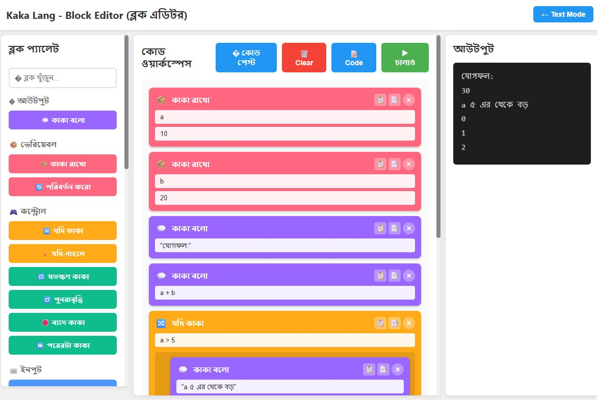

# কাকা ল্যাং (Kaka Lang)

তৈরি করেছেন **কৃষ্ণেন্দু পাল** ([@bidhata](https://krishnendu.com))  
**ওয়েবসাইট**: [krishnendu.com](https://krishnendu.com)  
**GitHub**: [github.com/bidhata/kaka-lang](https://github.com/bidhata/kaka-lang)

বাংলায় লেখা একটি মজার প্রোগ্রামিং ভাষা, [bhai-lang](https://github.com/DulLabs/bhai-lang) দ্বারা অনুপ্রাণিত।
কোড শুরু হয় `ও কাকা` দিয়ে এবং শেষ হয় `আসি কাকা` দিয়ে।

## 🎉 DEMO is Live :  [https://kaka-lang.krishnendu.com](https://kaka-lang.krishnendu.com) ##


## 🎉 নতুন: ভিজ্যুয়াল ব্লক এডিটর!

Scratch-এর মতো ড্র্যাগ-এন-ড্রপ ইন্টারফেস দিয়ে প্রোগ্রামিং শিখুন! শিক্ষার্থীদের জন্য পারফেক্ট।



- 🧩 কোড টাইপ করার পরিবর্তে ভিজ্যুয়াল ব্লক
- 🎨 ক্যাটাগরি অনুযায়ী রঙিন
- 🔄 ব্লক এবং টেক্সটের মধ্যে টগল করুন
- 📚 সম্পূর্ণ টিউটোরিয়াল অন্তর্ভুক্ত
- 📱 মোবাইল ও ট্যাবলেট অপটিমাইজড

**[৫ মিনিটে শুরু করুন →](./web/QUICKSTART.md)** | **[সম্পূর্ণ ডকুমেন্টেশন →](./web/INDEX.md)**

## ইনস্টলেশন

```bash
npm install -g kaku-lang
# অথবা সরাসরি চালান
npx ts-node src/index.ts <filename>
```

## সিনট্যাক্স

### এন্ট্রি/এক্সিট
- শুরু: `ও কাকা`
- শেষ: `আসি কাকা`

### ভেরিয়েবল
- ডিক্লেয়ার: `কাকা রাখো <var> = <value>;`
  - উদাহরণ: `কাকা রাখো a = 10;`

### প্রিন্টিং
- প্রিন্ট: `কাকা বলো <expression>;`
  - উদাহরণ: `কাকা বলো "হ্যালো ওয়ার্ল্ড";`

### কন্ডিশনাল
- If: `যদি কাকা (condition) { ... }`
- Else: `নাহলে কাকা { ... }`

```
যদি কাকা (a > 10) {
  কাকা বলো "a বড়";
} নাহলে কাকা {
  কাকা বলো "a ছোট";
}
```

### লুপ
- While: `যতক্ষণ কাকা (condition) { ... }`

```
যতক্ষণ কাকা (i < 5) {
  কাকা বলো i;
  i = i + 1;
}
```

### ডেটা টাইপ
- সংখ্যা: `0-9` এবং বাংলা ডিজিট `০-৯`।
- স্ট্রিং: `"text"` বা `'text'`।
- বুলিয়ান: `ঠিক` (true), `ভুল` (false)।
- নাল: `ফালতু`।

### কীওয়ার্ড ম্যাপিং

| ইংরেজি | কাকা ল্যাং | অর্থ |
|---|---|---|
| hi bhai | ও কাকা | হ্যালো আংকেল |
| bye bhai | আসি কাকা | বাই আংকেল |
| bol bhai | কাকা বলো | আংকেল বলো |
| bhai ye hai | কাকা রাখো | আংকেল রাখো |
| agar bhai | যদি কাকা | যদি আংকেল |
| warna bhai | নাহলে কাকা | নাহলে আংকেল |
| jab tak bhai | যতক্ষণ কাকা | যতক্ষণ আংকেল |
| bas kar bhai | ব্যাস কাকা | থামো আংকেল (Break) |
| agla dekh bhai | পরেরটা কাকা | পরেরটা আংকেল (Continue) |
| sun bhai | কাকা শোনো | আংকেল শোনো (Input) |
| aur bhai | এবং | এবং |
| ya bhai | অথবা | অথবা |
| function bhai | ফাংশন কাকা | ফাংশন |
| wapas le bhai | ফেরত নাও | রিটার্ন |

### ইনপুট
- `কাকা শোনো` (Input): এক্সিকিউশন থামিয়ে ইনপুট নেয়।
  - উদাহরণ: `কাকা রাখো name = কাকা শোনো;`

### ফাংশন
- ডিফাইন: `ফাংশন কাকা <name>(args) { ... }`
- রিটার্ন: `ফেরত নাও <value>;`
- কল: `name(args);`

### অ্যারে (তালিকা)
- তৈরি: `[val1, val2]`
- অ্যাক্সেস: `list[0]`
- মেথড: `list["push"](val)`, `list["length"]`

## ওয়েব কম্পাইলার
ওয়েব-ভিত্তিক IDE চালান:
```bash
cd web
npm install
npm run dev
```

### বৈশিষ্ট্য:
- **টেক্সট এডিটর মোড**: 
  - সিনট্যাক্স হাইলাইটিং (বেসিক এডিটর)
  - ভার্চুয়াল কীবোর্ড: কাকা কীওয়ার্ড সহজে ইনসার্ট করতে বাটনে ক্লিক করুন!
  - ইন্টিগ্রেটেড আউটপুট কনসোল
  
- **ব্লক এডিটর মোড** (নতুন! 🧩):
  - Scratch-এর মতো ভিজ্যুয়াল প্রোগ্রামিং ইন্টারফেস
  - প্রোগ্রাম তৈরি করতে ব্লক ড্র্যাগ এবং ড্রপ করুন
  - কোডিং শেখার জন্য শিক্ষার্থীদের জন্য পারফেক্ট
  - ক্যাটাগরি অনুযায়ী রঙিন ব্লক
  - টাইপিং প্রয়োজন নেই!
  - বিস্তারিত গাইডের জন্য [Block Editor Tutorial](./examples/block_tutorial.md) দেখুন

হেডারে বাটন ব্যবহার করে মোডের মধ্যে সুইচ করুন।

## ডকুমেন্টেশন
সম্পূর্ণ কোডিং গাইডের জন্য, [GUIDE.md](./GUIDE.md) বা [GUIDE_BN.md](./GUIDE_BN.md) (বাংলা) দেখুন।

## ব্লক এডিটর ফিচার

### ব্লক ক্যাটাগরি:
- 💬 আউটপুট (কাকা বলো)
- 📦 ভেরিয়েবল (কাকা রাখো, পরিবর্তন করো)
- 🎮 কন্ট্রোল (যদি কাকা, যতক্ষণ কাকা, পুনরাবৃত্তি, ব্রেক, কন্টিনিউ)
- ⌨️ ইনপুট (কাকা শোনো)
- 🔢 গণিত ও তুলনা (+, -, ×, ÷, >, <, ==, !=)
- 🔗 লজিক (এবং, অথবা, নয়)
- 💎 মান (সংখ্যা, টেক্সট, ঠিক, ভুল)
- ⚙️ ফাংশন (ফাংশন কাকা, ফেরত নাও, কল করো)
- 📋 তালিকা (তৈরি, যোগ করো, নাও, দৈর্ঘ্য)
- 💭 অন্যান্য (মন্তব্য, অপেক্ষা)

### ব্লক এডিটর ফিচার:
- ✂️ কপি/পেস্ট ব্লক
- 📑 ডুপ্লিকেট ব্লক
- 🗑️ ব্লক ডিলিট এবং ওয়ার্কস্পেস ক্লিয়ার
- 📄 টেক্সট কোড থেকে ব্লকে রূপান্তর
- 📝 ব্লক থেকে জেনারেটেড কোড দেখুন
- 🔍 ব্লক সার্চ/ফিল্টার
- 🎨 অ্যানিমেশন এবং ভিজ্যুয়াল ইফেক্ট

## উদাহরণ

### সাধারণ প্রোগ্রাম:
```javascript
ও কাকা
  কাকা বলো "হ্যালো ওয়ার্ল্ড!";
আসি কাকা
```

### লুপ সহ:
```javascript
ও কাকা
  কাকা রাখো i = 0;
  যতক্ষণ কাকা (i < 5) {
    কাকা বলো i;
    i = i + 1;
  }
আসি কাকা
```

### ফাংশন সহ:
```javascript
ও কাকা
  ফাংশন কাকা greet(name) {
    কাকা বলো "হ্যালো " + name;
  }
  
  greet("দুনিয়া");
আসি কাকা
```

## Vercel-এ ডিপ্লয়

প্রজেক্টটি Vercel-এ ডিপ্লয় করার জন্য কনফিগার করা আছে:

```bash
# Vercel CLI ইনস্টল করুন
npm install -g vercel

# লগইন করুন
vercel login

# ডিপ্লয় করুন
vercel --prod
```

বিস্তারিত নির্দেশনার জন্য [DEPLOYMENT.md](./DEPLOYMENT.md) দেখুন।

## লাইসেন্স
ISC

## কন্ট্রিবিউশন
এটি একটি শিক্ষামূলক প্রজেক্ট। অন্বেষণ এবং শিখতে স্বাগতম!

---

কাকা ল্যাং দিয়ে কোডিং উপভোগ করুন! 🎉
